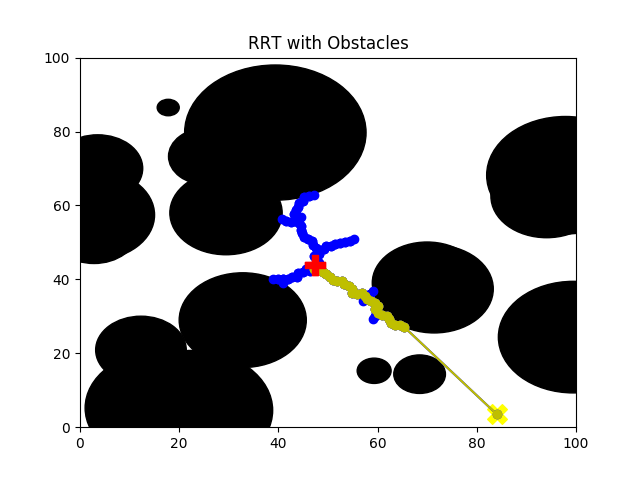

# Rapidly-Expanding Random Tree Implementation

#### Josh Cohen MSR Hackathon Day 3

#

My attempt to implement the RRT algorithim in python.

An rrt object is instantialized with a max number of node attempts. This object instantiates a obstacle manager object which populates a 100,100 map with a requested number of circle obstacles at a requested fixed max radius. To finish its initialization the rrt class randomly plots a root and goal on the map ensuring these points do not exist within an obstacle.

### Methods of the RRT class:
gen_random() - generate a *random* tuple that represents a theoretical point on the map

plot_ploint() - plots point on the map, has logic for special plotting of root & goal

nearest_vertex(point) - takes a randomly generated point seen as a theoretical point and finds the closest existing vertex to that point. returns the nearest vertex and distance to theoretical point

unit_step_to_nearest_vertex(point, vertex, distance) - takes the theoretical point, the nearest vertex to that point, and the distance between the two. It uses this to conduct vector operations to calculate the unit step away from the neatest vertex in the direction of the theoretical point. This unit step is of size **self.delta**

add_to_vertex_list(new_vert, nearest_vertex) - this is conditionally called if the method from the obstacle manager class determines there is no collision with any obstacles (explored in obstacle manager class methods). If it is determined that plotting this new unit step point does not intersect with any obstacles, this method adds the new node to the vertex list with the parent node specified as the nearest vertex as well as adds this new node as a child of the parent node. 

recurse_win(self, node) - is fed a node and recursivley finds its parent node while plotting the win path, stops at root node

run(number of points) - this is main method. input is max number of nodes to be plotted. it calls gen random to get a random point, then finds the nearest plotted vertex to that point using nearest_vertex(). It then attempts to create a new vertex that is a unit step away from the nearest vertex in the dircetion of the theoretical point, this new_vert is passed back from unit_step_to_nearest_vertex(). Before being added to the vertex list and plotted we must ensure this new vertex does not intersect with any obstacles. This is checked by the collision detect method from the obstacle manager class. If a collision is not detected (by the function returning False) then the new vertex is added to the vertex list, plotted on the map, and the straightline win condition is checked. If a collision is detected we increment a missed variable, this missed variable is then the recursive input to the run function such that, unless goal is reached, the requested number of points is plotted.  

### Methods of the obstacle_manager class:
gen_circle_obstacles(num_circles) - generates the specified number of circles, randomly assigns a radius up to MAX RADIUS, plots them on map, and adds them to the list of circle_obstacles

init_collision_detect(p1) - checks if a singular point is within any circle obstacles, used for checking goal and root for conflicts with existing obstacles

collision_detect(p1, p2, dist) - this is the workhorse function of this class. it iterates through all obsctacles tracked in circile_obstacles. It uses Paul Bourke's discussion of determining the closset point on a line to a specified point as inspiration. This method checks if that point (on the line specified by the end points that are the new vertex and the nearest vertex) exists outside or inside the radius of the specific circle we are checking. If the point exists outside the circle radius we know that this line and that circle do not intersect. If this point exists within the circle we have to determine if the closest point exists on the line segment or not. Fortunately Bourke's algorithmic approach facilitates this. If the value of u found is between 0 and 1 we know it exists on the line segment and is therefore a collision, otherwise it is not a collision if both points exist outside the circle radius. 

win_check(vert, goal) - if a new vertex is added to our map we must check if it has a straightline path to our goal, thereby satisfying our win condition. This simply calls our collision detection method on the new vertex and the goal and attempts to determine if that straightline path interesects with any obstacles.  

